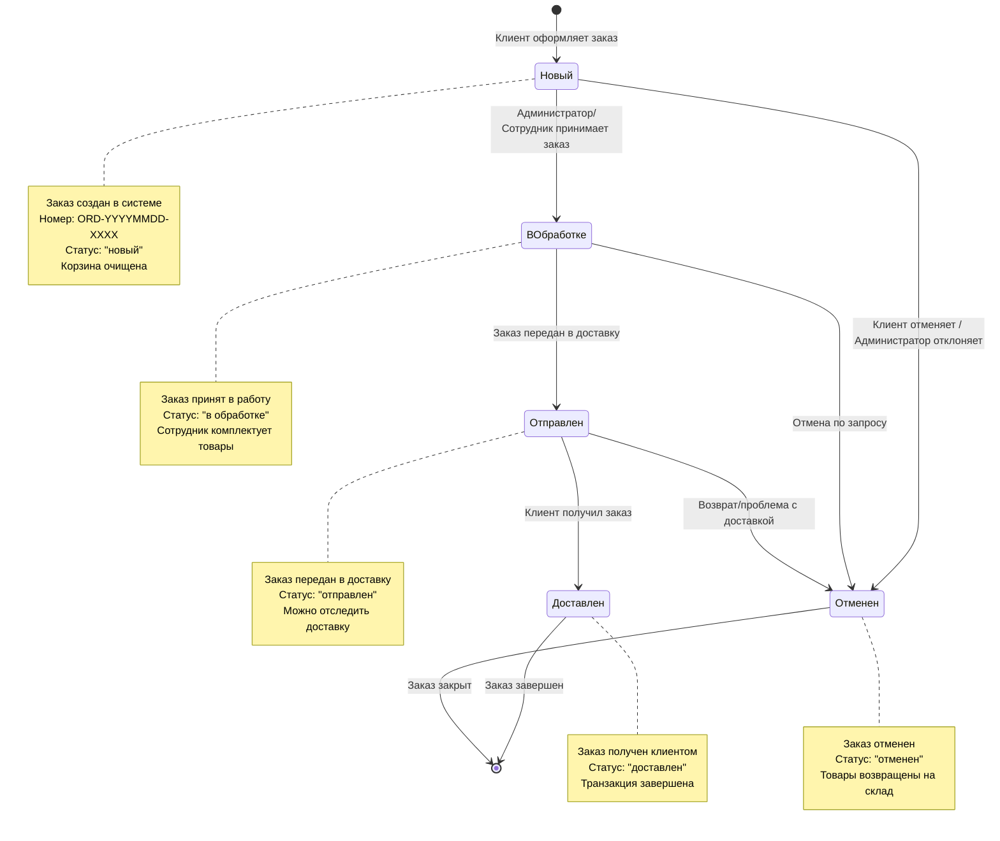
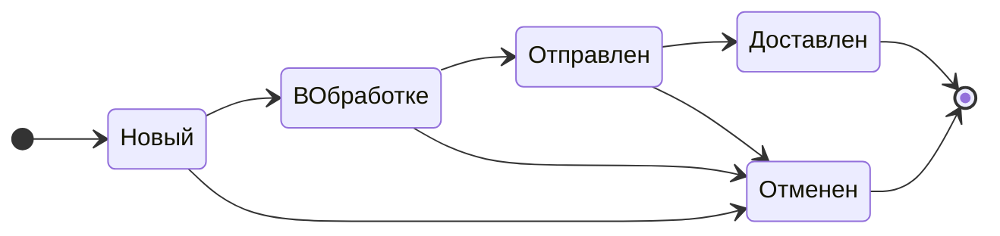
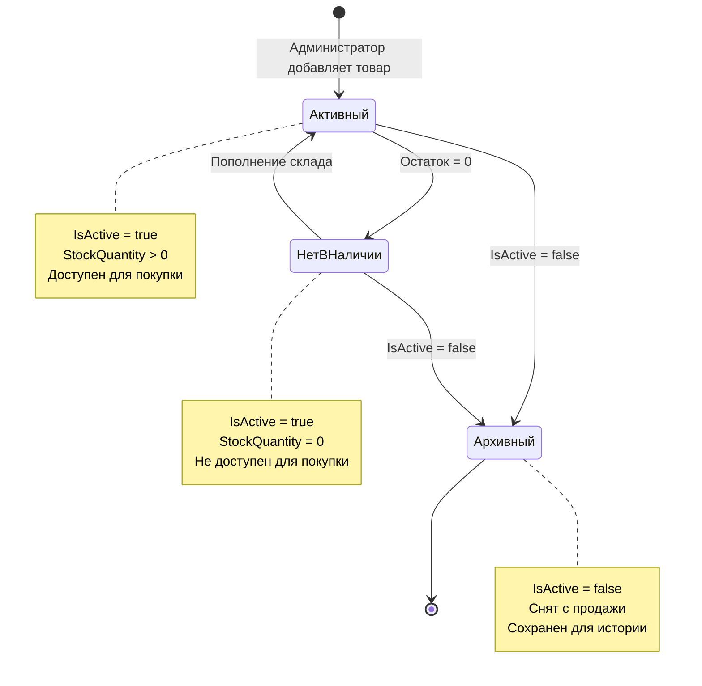
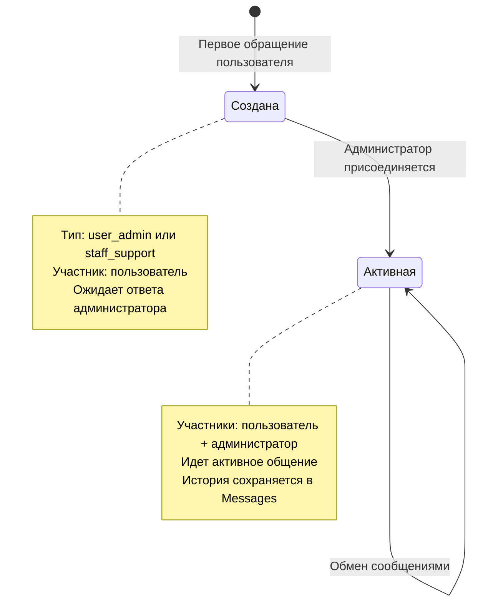

# ДИАГРАММА ПЕРЕХОДОВ СОСТОЯНИЙ ЗАКАЗА
# Система управления интернет-магазином скейтбординга

## Диаграмма в формате Mermaid



## Описание состояний заказа

### 1. Состояние "Новый" (new)
**Как попадает:** Клиент оформляет заказ через корзину (CartView.PlaceOrder)
**Характеристики:**
- Автоматически генерируется номер заказа (ORD-YYYYMMDD-XXXX)
- Фиксируется общая сумма (TotalAmount)
- Создаются позиции заказа (OrderItems) с текущими ценами
- Используется DateTime.UtcNow для CreatedAt и UpdatedAt
- Корзина автоматически очищается (CartManager.Clear())
**Доступные действия:**
- Администратор/Сотрудник: перевести в "в обработке"
- Администратор/Клиент: отменить заказ

### 2. Состояние "В обработке" (в обработке)
**Как попадает:** Администратор или сотрудник меняет статус через выпадающий список в OrderView
**Характеристики:**
- Заказ принят в работу
- Сотрудник комплектует товары
- Проверяется наличие на складе
**Доступные действия:**
- Администратор/Сотрудник: перевести в "отправлен"
- Администратор: отменить заказ

### 3. Состояние "Отправлен" (отправлен)
**Как попадает:** Администратор или сотрудник меняет статус после передачи в доставку
**Характеристики:**
- Заказ передан курьерской службе
- Можно добавить трек-номер для отслеживания
- Клиент видит статус в ClientOrdersView
**Доступные действия:**
- Администратор/Сотрудник: перевести в "доставлен"
- Администратор: отменить (в случае возврата)

### 4. Состояние "Доставлен" (доставлен)
**Как попадает:** Администратор или сотрудник подтверждает получение клиентом
**Характеристики:**
- Заказ успешно доставлен клиенту
- Транзакция завершена
- Финальное состояние (успешное завершение)
**Доступные действия:**
- Нет (конечное состояние)

### 5. Состояние "Отменен" (отменен)
**Как попадает:** 
- Клиент отменяет до обработки
- Администратор отклоняет заказ
- Возврат после отправки
**Характеристики:**
- Заказ не будет выполнен
- Товары возвращаются на склад (логически)
- Финальное состояние (неуспешное завершение)
**Доступные действия:**
- Нет (конечное состояние)

## Технические детали реализации

### Изменение статуса в коде:
```csharp
// OrderView.axaml.cs - StatusComboBox_SelectionChanged
private void StatusComboBox_SelectionChanged(object? sender, SelectionChangedEventArgs e)
{
    var comboBox = sender as ComboBox;
    var orderVM = comboBox?.DataContext as OrderViewModel;
    var selectedStatusItem = comboBox?.SelectedItem as ComboBoxItem;

    if (orderVM == null || selectedStatusItem == null) return;

    var newStatus = selectedStatusItem.Content.ToString();

    if (orderVM.Status == newStatus) return;

    using var context = new SkateshopDbContext();
    var orderToUpdate = context.Orders.Find(orderVM.Id);
    if (orderToUpdate != null)
    {
        orderToUpdate.Status = newStatus;
        context.SaveChanges();
        orderVM.Status = newStatus;
    }
}
```

### Создание заказа:
```csharp
// CartView.axaml.cs - PlaceOrder_Click
var order = new Order
{
    CustomerId = _currentUserId,
    OrderNumber = GenerateOrderNumber(),
    Status = "новый",
    CreatedAt = DateTime.UtcNow,
    UpdatedAt = DateTime.UtcNow,
    TotalAmount = CartManager.Items.Sum(i => i.Total),
    Comment = CommentTextBox.Text
};
```

### Возможные статусы в системе:
- "новый" (new) - начальное состояние
- "в обработке" - заказ принят в работу
- "отправлен" - передан в доставку
- "доставлен" - успешно доставлен
- "отменен" - отменен по любой причине

## Диаграмма для экспорта в PNG

Вы можете использовать этот код на сайте https://mermaid.live для создания PNG:

1. Откройте https://mermaid.live
2. Вставьте код диаграммы (между ```mermaid и ```)
3. Настройте тему (рекомендую "dark" или "default")
4. Нажмите "Actions" → "PNG" для экспорта

## Альтернативная диаграмма (упрощенная)



## Дополнительная диаграмма: Состояния товара



## Дополнительная диаграмма: Состояния беседы в чате



---

## Инструкция по использованию

1. **Для Word документа:**
   - Экспортируйте диаграмму в PNG через mermaid.live
   - Вставьте изображение в раздел 2.3 "Описание алгоритма системы"
   - Подпишите как "Рисунок 5 – Диаграмма переходов состояний заказа"

2. **Для презентации:**
   - Используйте упрощенную версию диаграммы
   - Экспортируйте в высоком разрешении

3. **Для документации:**
   - Используйте полную версию с примечаниями
   - Добавьте описание каждого состояния из этого файла
